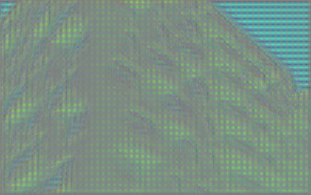
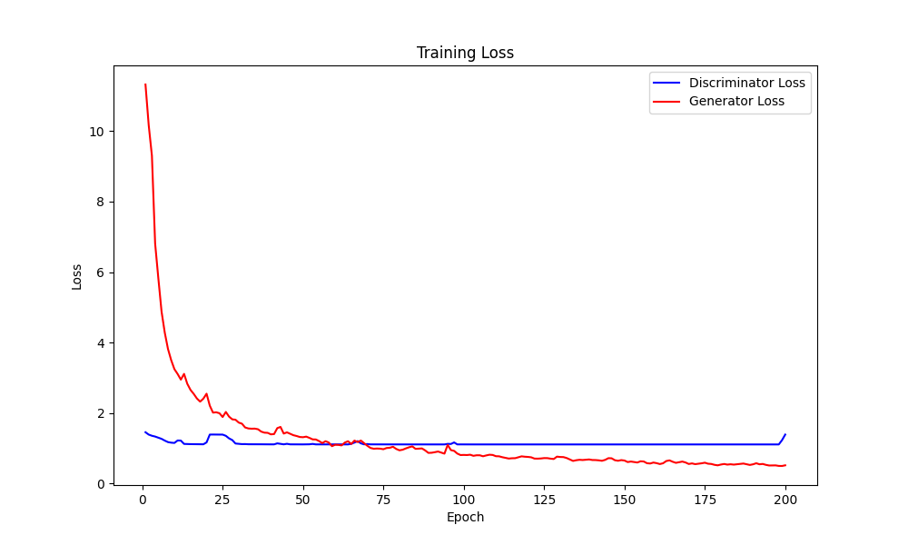

# SRGAN Super-Resolution Reconstruction

English / [中文](readme_zh.md)

↑ 点击切换语言

This project builds a custom **SRGAN** model. This custom version is more simplified and lightweight, making it easier for beginners to understand and learn the basic principles of Super-Resolution Generative Adversarial Networks.

Due to the simplification of the model implementation, the generated images may contain some noise.

Comparison of reconstruction results is shown below.

**Low-Resolution Image**


**High-Resolution Image After Model Processing**


## Table of Contents

- [Training Phase Demonstration](#training-phase-demonstration)
- [Multilingual Annotations](#multilingual-annotations)
- [Dataset](#dataset)
- [File Structure](#file-structure)
- [Contributions](#contributions)

## Training Phase Demonstration

Below are the reconstructed images at the start, after 100 epochs, and after 200 epochs.

**Before Training**



**After 100 Epochs**


**After 200 Epochs**


**Trend of Loss During Training**



## Multilingual Annotations

To make the code easier to understand for developers from different language backgrounds, this project provides comments in both English and Chinese.

## Dataset

The dataset used in this project is the **Urban100** dataset, which was introduced by **Professor Jia-Bin Huang** and others in their paper "Single Image Super-Resolution from Transformed Self-Exemplars". It is used to evaluate and test the performance of image super-resolution algorithms.

The Urban100 dataset can be downloaded from the following sources:

- [Kaggle](https://www.kaggle.com/datasets/harshraone/urban100)
- [Github](https://github.com/jbhuang0604/SelfExSR/tree/master/data)

This project uses the dataset downloaded from **Kaggle** and only utilizes the X2 portion for training.

If you want to train on the X4 portion, you can add one more layer to the upsampling part of the generator.

The test image from [Pexels](https://www.pexels.com/photo/a-tram-transportation-in-the-city-10342323/)

## File Structure

The project's file structure is as follows:

```c++
Super_Resolution/
│
├── data/ 
│   └── Urban 100
│
├── images/ 
│   └── image_epoch...png
│
├── model/
│   ├── discriminator.pth
│   └── generator.pth
│
├── utils(en/zh)/
│   ├── __init__.py
│   ├── discriminator.py
│   ├── generator.py
│   ├── test.ipynb 
│   └── train.py
└── main.py 
```

## Contributions

All forms of contributions are welcome! Whether it's reporting bugs or making suggestions, your help is greatly appreciated!!
