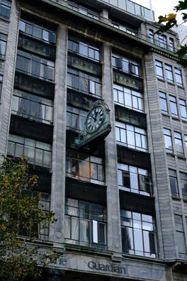
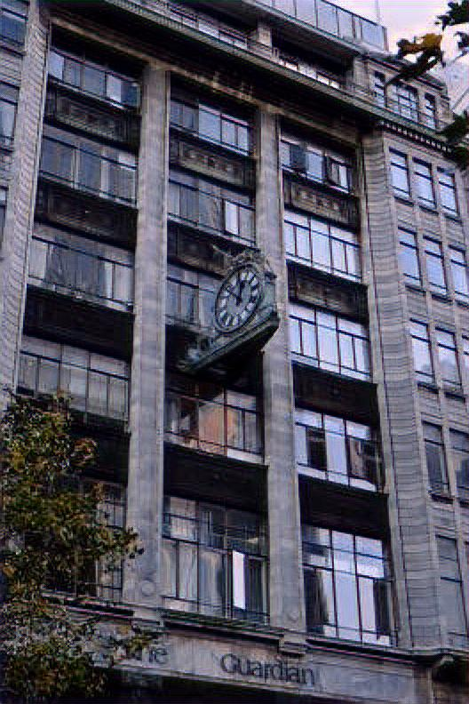
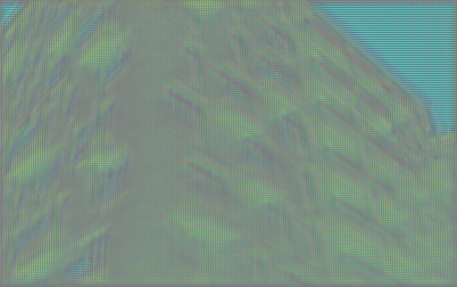
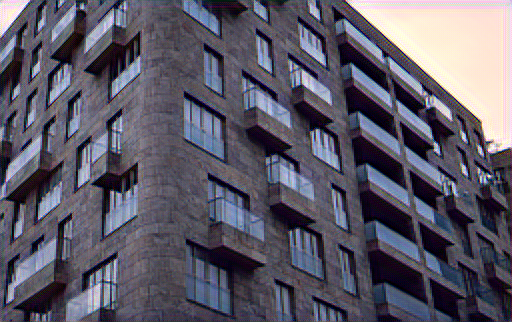
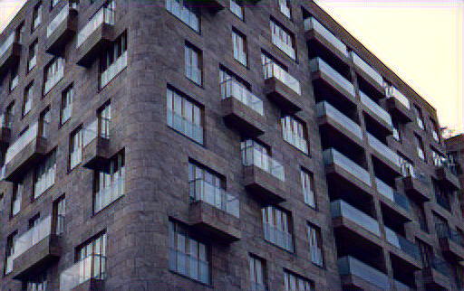
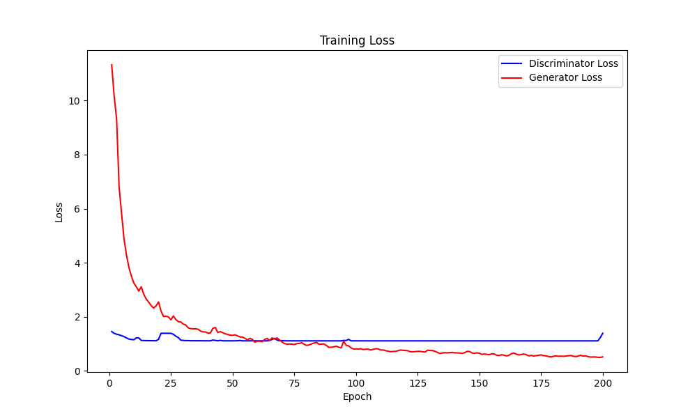

# SRGAN 超分辨率重构

[English](readme.md)  /  中文

↑ Click to switch language

本项目构建了一个自定义的 **SRGAN** 模型 该自定义版本更加简便和轻量化 可以帮助初学者更容易理解和学习超分辨率生成对抗网络的基本原理

由于简化了模型实现 该模型在生成图像时可能存在一些轻微的噪音

重构结果对比如下

**低分辨率图像**



**经过模型重构后的高分辨率图像**



## 目录

- [训练阶段演示](#训练阶段展示)
- [多语言注释](#多语言注释)
- [数据集](#数据集)
- [文件结构](#文件结构)
- [贡献](#贡献)

## 训练阶段展示

以下为训练开始前、第100轮和第200轮的重构图像

**开始前**



**第100轮**



**第200轮**



**训练过程中损失的变化趋势**



## 多语言注释

为了让不同语言背景的开发者更容易理解代码 本项目的注释提供了英文和中文两种版本

## 数据集

本项目使用的数据集为 **Urban100** 数据集 它由 **黄嘉彬教授** 等人在其论文《Single Image Super-Resolution from Transformed Self-Exemplars》中引入 用来评估和测试图像超分辨率算法的性能

Urban100 数据集可以通过以下方式下载

- [Kaggle](https://www.kaggle.com/datasets/harshraone/urban100)
- [Github](https://github.com/jbhuang0604/SelfExSR/tree/master/data)

本项目使用的是在 **Kaggle** 上下载的数据集 并只使用了X2部分进行训练 

如果想训练X4部分 只需要在生成器的上采样部分再增加一层即可

测试图片来自 [Pexels](https://www.pexels.com/photo/a-tram-transportation-in-the-city-10342323/)

## 文件结构

项目的文件结构如下

```c++
Super_Resolution/
│
├── data/ 
│   └── Urban 100
│
├── images/ 
│   └── image_epoch...png
│
├── model/
│   ├── discriminator.pth
│   └── generator.pth
│
├── utils(en/zh)/
│   ├── __init__.py
│   ├── discriminator.py
│   ├── generator.py
│   ├── test.ipynb 
│   └── train.py
└── main.py 
```

## 贡献

欢迎所有形式的贡献！无论是报告错误还是提出建议 非常感谢！！